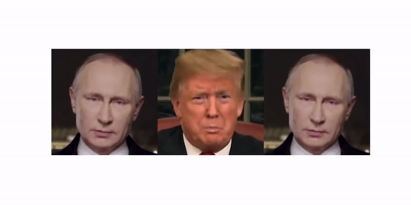

# Image2Video

This repository is a fork of the original source code for the paper [First Order Motion Model for Image Animation](https://papers.nips.cc/paper/8935-first-order-motion-model-for-image-animation) by Aliaksandr Siarohin, [Stéphane Lathuilière](http://stelat.eu), [Sergey Tulyakov](http://stulyakov.com), [Elisa Ricci](http://elisaricci.eu/) and [Nicu Sebe](http://disi.unitn.it/~sebe/).

**Its objective is to provide a straightforward script to get a moving image out of just one photo and video (and audio)!** See examples below.

## How to run

1 - Clone the repository

2 - `bash requirements.sh`

3 - `python main.py path_to_your_image path_to_your_video`

The arguments `path_to_your_image` and `path_to_your_video` are relative to the root of this repository (where you run main.py)

For what I tested, the script works with JPG/PNG imagens and MP4 videos. Do not know about the other formats.

The video should be up to ~20seconds or it will take **a lot of time** and probably consume all your RAM. Moreover, try to have **simple photos and videos**. By that means, photos/videos that only focus on the face of the person and the **video must not have a lot of abrupt transitions** (see example below). If the photos/videos don't follow the requirements, the result will probably be very bad.

If you have any problem, feel free to reach me out. A big thank you for the original authors of the code for open sourcing this beauty.

Have fun!
## Example usage

Below you can see how we added movement to Putin's face from Trump's video.

You just need to run `python main.py putin.png trump.mp4` and the script will generate a `generated_video.mp4` (which is the video on the right). 
Although the video (`trump.mp4`) does not contain audio, yours can have and the script will try to maintain the audio as well.